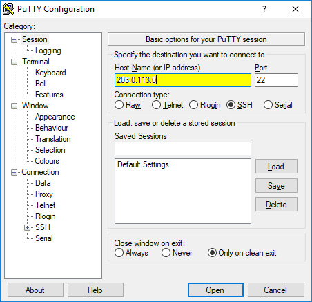

# DigitalOcean + Django Server Setup

## For connecting to your droplet with a Django app...

> References: 
>
> https://www.digitalocean.com/community/tutorials/how-to-create-a-django-app-and-connect-it-to-a-database
> https://www.digitalocean.com/community/tutorials/initial-server-setup-with-ubuntu-20-04
> https://docs.digitalocean.com/products/droplets/how-to/connect-with-ssh/putty/


 Prerequisites:
> * An Ubuntu droplet on DigitalOcean (5-10 USD a month) that you have the IP address for 
> * PuTTy installed on Windows
> * Powershell with Admin Rights (or VSCode with Admin Rights)
> * Internet Access

<br/>

> **Question:**
>
> "Why look at this tutorial when I can just check those links out?"
>
> **Answer:**
>
> **#1** - This tutorial consolidates those 3 tutorials into a single tutorial.
>
> **#2** - This tutorial includes more troubleshooting than those other tutorials.
>
> **#3** - This tutorial was done by someone who has actually tried to do these tutorials and run into problems, and solved them.
>
> **#4** - This tutorial can be forked on Github and improved if need be.


#
## 1.1 - Connect to Droplet with Putty


Connect to server with PuTTy
> Copy IP Address from the droplet you intend to work on.
> 
> Paste it into PuTTy, follow instructions:
>
> Confirm that the Port is set to 22 and that the Connection type SSH is selected. 
>
> \[Reminder: Use the correct IP address, not the one in the picture...\]
> 
> 
>
> Next, click on SSH in the left sidebar (under Connection). Make sure 2 is selected for SSH protocol version.
> 
>
> Use a private key file if you want extra protection (optional):
>
> 
>
> 
>
> Consider saving your session so you don't need to redo all of this manually.
>
> 


After PuTTY starts, type in the root password that you chose when you created the Droplet. If you uploaded SSH keys, you are either connected directly or prompted for the password you set on your key.


#
## 1.2 - Basic User Setup on Droplet

You are now connected to the server, and PuTTy has opened a new terminal with access to your DigitalOcean server.
>

> Add user:
```
# adduser insert_name
```
>
> ...Give it a password:
```bash
New password : _
```
> ...Move user to sudo group.
>
```
# usermod -aG sudo insert_name
```
...This user will now have access to sudo commands.

#
## 2 - Setup Droplet thru the Terminal

We need to make sure that the firewall allows SSH connections so that we can log back in next time. We can allow these connections by typing:
```bash
# -> Look at list of apps
ufw app list
# -> Allow OpenSSH
ufw allow OpenSSH
```

Enable the firewall:
```
# ufw enable
```
Press Y and ENTER to proceed.

You can see all SSH connections that are allowed by typing:
```
ufw status
``` 

```bash
# -> Output
Status: active

To                         Action      From
--                         ------      ----
OpenSSH                    ALLOW       Anywhere
OpenSSH (v6)               ALLOW       Anywhere (v6)
```

The above indicates that **the firewall is currently blocking all connections except for SSH,** so, if you install and configure additional services, you will need to adjust the firewall settings to allow traffic in. 

```bash
# -> SSH into server to test if your new user works properly
$ ssh input_username@your_server_ip
```

> *(SSH not working?)*
> * Uninstall and reinstall OpenSSH Client in Windows 'Apps' 
>
> * Add 'C:Windows/System32/OpenSSH' to 'PATH'
 

#
## 3.1 - Install mySQL

You should now be logged into your first user created on your DigitalOcean droplet. You are connected by SSH. Continue: 
```
$ sudo apt update

$ sudo apt install mysql-server

$ sudo systemctl start mysql.service
```
These commands will install and start MySQL, but will not prompt you to set a password or make any other configuration changes. Because this leaves your installation of MySQL insecure, we will address this next.

#
## 3.2 - Configure mySQL

```
sudo mysql_secure_installation
```

You will be prompted for a password. Ideally, you would choose strength = 2 here.

(MySQL Failed Error Tips: https://www.nixcraft.com/t/mysql-failed-error-set-password-has-no-significance-for-user-root-localhost-as-the-authentication-method-used-doesnt-store-authentication-data-in-the-mysql-server-please-consider-using-alter-user/4233 

```
1. Open the terminal application.
2. Terminate the mysql_secure_installation from another terminal using the killall command:
> sudo killall -9 mysql_secure_installation
3. Start the mysql client:
> sudo mysql
4. Run the following SQL query:
> mysql>ALTER USER 'root'@'localhost' IDENTIFIED WITH mysql_native_password BY 'SetRootPasswordHere';
> mysql> exit
5.Then run the following command to secure it:
> sudo mysql_secure_installation
6. When promoted for the password enter the SetRootPasswordHere (or whatever you set when you ran the above SQL query)
That is all.)
```

From there, you can press Y and then ENTER to accept the defaults for all the subsequent questions. This will remove some anonymous users and the test database, disable remote root logins, and load these new rules so that MySQL immediately respects the changes you have made.

Once the script completes, your MySQL installation will be secured. You can now move on to creating a dedicated database user with the MySQL client.

#
## 3.3 - Creating a Dedicated MySQL User and Granting Privileges

Upon installation, MySQL creates a root user account which you can use to manage your database. This user has full privileges over the MySQL server, meaning it has complete control over every database, table, user, and so on. 

Therefore, it’s best to avoid using this account outside of administrative functions. This step outlines how to use the root MySQL user to create a new user account and grant it privileges:

```
$ sudo mysql
(or...:
$ sudo mysql -u root -p)
```
```sql
mysql> CREATE USER 'insert_username'@'insert_host' IDENTIFIED BY 'insert_password';
```

> Note: see https://www.digitalocean.com/community/tutorials/how-to-install-mysql-on-ubuntu-20-04 if you plan on using a PHP application, such as phpMyAdmin, which would require the mysql_native_password plugin instead for compatibility.

> Note: Use 127.0.0.1 instead of 'localhost'. Django tends to really really NOT like 'localhost'. So use '127.0.0.1'.
```sql
/* BASE FORMAT: */
/* mysql> GRANT PRIVILEGE ON database.table TO 'username'@'host'; */

/* EXAMPLE 'GRANT' COMMAND: */
mysql> GRANT CREATE, ALTER, DROP, INSERT, UPDATE, DELETE, SELECT, REFERENCES, RELOAD on *.* TO 'coco'@'127.0.0.1' WITH GRANT OPTION;

/* GIVING THE USER "ROOT" RIGHTS: */
mysql> GRANT ALL PRIVILEGES ON *.* TO 'coco'@'127.0.0.1' WITH GRANT OPTION;
```

Following this, it’s good practice to run the FLUSH PRIVILEGES command. This will free up any memory that the server cached as a result of the preceding CREATE USER and GRANT statements:
```sql
/* Clear server memory cache */

mysql> FLUSH PRIVILEGES;

/* Then you can exit... */

mysql> exit
```

In the future, to log in as your new MySQL user, you’d use a command like the following:
```
$ mysql -u coco -p
```

The -p flag will cause the MySQL client to prompt you for your MySQL user’s password in order to authenticate.

#
## 3.4 - Testing MySQL 

Check that mySQL is running automatically already.
```
$ systemctl status mysql.service
```

IF it's not running when you check, you can start it manually with:
```
$ sudo systemctl start mysql
```

#
## 3.5 - Creating your Database

Let's see what databases we have so far:
```bash
> ssh myusername@myserverIP

$ sudo mysql
# [ENTER PASSWORD]

mysql> SHOW DATABASES;
```
```
OUTPUT:

+--------------------+
| Database       	|
+--------------------+
| information_schema |
| mysql         	|
| performance_schema |
| sys            	|
+--------------------+
4 rows in set (0.00 sec)

```
By default, you will have 4 databases already created: information_schema, MySQL, performance_schema and sys. You won’t need to touch these, as they contain information important for the MySQL server itself.

```sql
mysql> CREATE DATABASE blog_data;

mysql> SHOW DATABASES;

mysql> GRANT ALL ON blog_data.* TO 'djangouser'@'127.0.0.1';
```
(If an error is thrown, make sure that you have 'sudo' privileges')

```sql
mysql> FLUSH PRIVILEGES;

/* ^C (Press Ctrl+C to exit) */

mysqsl> exit;

/* "Bye" */
```
#
## 3.6 - Create mySQL option file

Rather than specifying your MySQL connection details in the Django configuration file, you can store them in an option file. Many MySQL programs can read option files — also known as configuration files — for information like startup options or connection details. This can be convenient, as you only have to store your database login credentials in one place.

Open the my.cnf configuration file with your preferred text editor to update your MySQL credentials. Here we’ll use nano:
```
$ sudo nano /etc/mysql/my.cnf
```

In the file, enter the following lines at the END of the file:
```
[client]
database = my_database
user = my_mysql_username
password = my_mysql_password
# OMITTED DUE TO ERRORS: default-character-set = utf8
```

Once the file has been edited, you need to restart MySQL for the changes to take effect:
```
$ sudo systemctl daemon-reload

$ sudo systemctl restart mysql
```

> ## "Which password is which!?"
>> Don't get lost, you'll have a total of five passwords for this project:
>> * **DigitalOcean account** password *(easier if you just connect your GitHub)*
>> * root **SSH** password *-> to connect to your server*
>> * my_username **SSH** password *-> to connect to your server*
>> * root **mySQL** password *-> to connect to your server's mySQL database*
>> * my_username **mySQL** password *-> to connect to your server's mySQL database*
>> 
>
> Yeah, you're welcome! It can get very confusing, very quickly.

#
## 4 - Create the Django Skeleton

Here, you will create a Django project. This is basically the easy part.

```
$ mkdir my_blog_app

$ cd my_blog_app

$ sudo apt install python

$ sudo apt install python3-venv

$ ls

$ sudo python3 -m venv env

$ . env/bin/activate

(env) me@ubuntu:$ pip install django
```
> Having problems installing django using pip?
> 
> Trying changing folder permissions so that your USER can actually install django via pip.
> >https://careerkarma.com/blog/python-permissionerror-errno-13-permission-denied/
> > https://linux.die.net/man/1/chown
>
> ``` > sudo chown this_user /home/this_user/ -R  ```
> 
> "chown" -> change ownership of this folder
> 
> "/home/this_user/" -> the directory where you need to install django or whatever other problems you're having with installation.
> 
> "-R" -> do this recursively to all directories included.

```

(env) me@ubuntu:$ django-admin startproject myblog

(env) me@ubuntu:$ cd myblog

(env) me@ubuntu:$ ls
```

```
Output:
myblog manage.py
```

Congrats, doesn't it feel good to be back in Django-land? Rather than in PuTTy, mySQL, etc. land? <3

#
## 5 - Installing MySQL Database Connector

Lots of terminal inputs only. No need to keep switching programs. Enjoy it! **READ THIS SECTION COMPLETELY BEFORE STARTING.**

This could get messy, though I've prepared for that a bit. If my solution doesn't work, then good luck...
```bash
# To be safe, upgrade pip, because that's caused problems for me before.
(env) me@ubuntu:$ pip install --upgrade pip

(env) me@ubuntu:$ sudo apt install libmysqlclient-dev default-libmysqlclient-dev

(env) me@ubuntu:$ pip install wheel

# Try this,
(env) me@ubuntu:$ sudo apt-get install python3-dev default-libmysqlclient-dev build-essential
(env) me@ubuntu:$ pip install mysqlclient
# https://python-forum.io/thread-36288.html
# https://pypi.org/project/mysqlclient/
# If the above command didn't work, perhaps these will substitute for it...?:
(env) me@ubuntu:$ pip install mysql-connector-python
(env) me@ubuntu:$ pip install pymysql
(env) me@ubuntu:$ sudo apt-get install python-dev default-libmysqlclient-dev
(env) me@ubuntu:$ sudo apt-get install python3-dev

# But, what actually worked for me when mysqlclient wouldn't install, was the following three:
(env) me@ubuntu:$ sudo apt-get upgrade
(env) me@ubuntu:$ sudo apt-get install python3-dev default-libmysqlclient-dev build-essential
(env) me@ubuntu:$ pip3 install mysqlclient
```

#
## 6.1 - Editing Django Project's Settings

Find your "settings.py" within your django project folder. Its filepath will be in the following format:

> .../my_containing_folder/my_django_app_name/my_django_app_name/settings.py

After navigating there, you need to nano it, in your ubuntu server of course:

```
$ nano settings.py
```

Near the bottom of the file, fix the TIME_ZONE field to be your current time zone.

```
...
# Internationalization
# https://docs.djangoproject.com/en/2.0/topics/i18n/

LANGUAGE_CODE = 'en-us'

TIME_ZONE = 'UTC'

USE_I18N = True

USE_L10N = True

USE_TZ = True
...
```

In my case, it would be 

```bash
# California (PST) is:
TIME_ZONE = 'America/Tijuana'
```

> For help, see: <br/>
> https://stackoverflow.com/questions/29311354/how-to-set-the-timezone-in-django <br/>
> https://en.wikipedia.org/wiki/List_of_tz_database_time_zones

Then, go to the END of settings.py and add this [STATIC ROOT] stuff:

```
# Static files (CSS, JavaScript, Images)
# https://docs.djangoproject.com/en/2.0/howto/static-files/

STATIC_URL = '/static/'
STATIC_ROOT = os.path.join(BASE_DIR, 'static')
```

Next, add your IP to the list of allowed hosts. **This is your SERVER's IP address, to be clear.** Also, make sure it retains the 'quotes'.

```
...
# SECURITY WARNING: don't run with debug turned on in production!
DEBUG = True

ALLOWED_HOSTS = ['your_server_IP_address']

# Application definition
...
```

After that, add the Python OS module that provides various functionalities for directories. Without this module, you will receive an error when setting up the administrative user to begin using the Django interface. To do this, you need to import the os module that will work on your respective operating system. Add the line import os above the from pathlib import Path line:

```
...
import os
from pathlib import Path

# Build paths inside the project like this: BASE_DIR / 'subdir'.
...
```

Now comes the part you worked so hard for earlier--changing the database for your Django project away from sqlite!

Change your database section in settings.py so that it resembles this:
```
...
# Database
# https://docs.djangoproject.com/en/3.0/ref/settings/#databases

DATABASES = {
	'default': {
    	'ENGINE': 'django.db.backends.mysql',
	'NAME': 'my_database',
	'USER': 'my_mysql_user',
	'PASSWORD': 'my_mysql_user_password',
	'HOST': '127.0.0.1'
    	'OPTIONS': {
        	'read_default_file': '/etc/mysql/my.cnf',
    	},
	}
}
...
```

> TIP: Make sure you copy/pasted those brackets correctly. Missing brackets can lead to some weird errors.

Finally, go ahead and secure your SECRET_KEY using (https://foxrow.com/generating-django-secret-keys):
```python
$ python
>>> import random
>>> ''.join(random.SystemRandom().choice('abcdefghijklmnopqrstuvwxyz0123456789!@#$%^&*(-_=+)') for i in range(50))
```
Save and close the file.

The read_default_file option points to /etc/mysql/my.cnf, the MySQL option file you edited earlier. This tells Django where it can find the relevant connection details to connect to the MySQL database you created earlier.

>HAVING TROUBLE? - By pointing Django to your MySQL option file within the OPTIONS setting as in this example, it will take precedence over any NAME setting, which would otherwise override the option file if you were to point to it outside of the OPTIONS setting.


#
## 6.2 - (Have a FUN) Migration in Django with your mySQL database:

From wherever your manage.py file is (in your Django project):

```bash
# Exit python environment then:
$ sudo apt-get upgrade
# Navigate back to django folder then:
$ . env/bin/activate

(env) me@ubuntu:$ python manage.py makemigrations

(env) me@ubuntu:$ python manage.py migrate
```

> ## HAVING TROUBLE? Let's try some solutions:
> ### "I can't migrate or makemigrations properly"...
> * ssh into server as root@my_server_ip
> * (enter password for root SSH)
> > THIS IS HOW YOU MUST LOGIN TO MYSQL, EVEN WHEN ROOT USER:
> * $ mysql -u root -p
> * (enter password for root mySQL)
> * mysql> CREATE USER my_username@localhost IDENTIFIED BY 'mypassword';
> * mysql> GRANT ALL ON my_database.* TO 'my_username'@'localhost'; <br/>
> * mysql> FLUSH PRIVILEGES;
> > (Note: this gives all permissions to alter and control your mySQL database to 'my_username'... be careful!)
>
> > Extra Note: Don't forget to get back into your VENV when trying to run 'manage.py' with Python! You're welcome!
>
> WANT TO LIST USERS in MYSQL? Type this:
> > mysql> SELECT User, Host FROM mysql.user;
>
> STUCK IN ROOT USER LOGIN, and can't find your django project? Type this to find the location of every manage.py of whatever directory you're currently in (try to 'cd ..' as far back as possible):
> > \# find $PWD -name manage.py
>
> FINALLY:
>
> "DID YOU MAKE SURE TO CORRECTLY GIVE YOUR FREAKING USER PRIVILEGES EARLIER?"
> > Here's a different version of GRANT that **actually worked** allowed me to makemigrations, replacing 'my_database' with the database name in question, no quotation marks: <br/>
> > mysql> GRANT ALL ON my_database.* TO 'my_username'@'localhost'; <br/>
> > mysql> FLUSH PRIVILEGES;


What if you are getting an access denied warning?

Check permissions with:
```mysql
mysql> SHOW GRANTS FOR 'this_user'@'this_host';
```

#
## 6.3 - Superuser Creation
After dealing with the mess that is migrations, Input this command:
```
(env) me@ubuntu:$ python manage.py createsuperuser
```
Then, follow the instructions to create your super user. You don't necessarily need to input your email here.
> **Question:**
>
> "Why do I want to create a super user?"
>
> **Answer:**
>
> Because, a superuser will have administrator rights and the ability to fiddle around with your database via Django's user-friendly database editor. It's handy! One of the main reasons you even want to use Django is to make use of its super user functionality.

#
## 7 - Adjusting Firewall Settings

Before testing the application, you need to adjust firewall settings.

Start by changing your 'ufw' settings to allow access to port 8000:

```
(my_env) me@ubuntu:$ sudo ufw allow 8000
```
Check the status to ensure these permission settings have been updated successfully:
```
(my_env) me@ubuntu:$ sudo ufw status
```

```
# -> Output
Status: active

To                         Action      From
--                         ------      ----
OpenSSH                    ALLOW       Anywhere
8000                       ALLOW       Anywhere
OpenSSH (v6)               ALLOW       Anywhere (v6)
8000 (v6)                  ALLOW       Anywhere (v6)
```

Your firewall settings should be good to go, and now you can test your connection...

#
## 8 - Test mySQL Connection to Django App

We're gonna run the server now. This will allow us to test that the configurations in Django are able to detect your mySQL server properly.

First, navigate to where your manage.py is at. Use this in an appropriate directory *(the file in question MUST be in your current directory or its subdirectories, or it will not be found)*:
```bash
find $PWD -name manage.py
```

Then, run your Django server, but in this special way:
```
(env) me@ubuntu:$ python manage.py runserver your-server-ip:8000
```

You should get that all-too-familiar ROCKET screen now!


 


Problem: "Why isn't my connection private?" Let's get to that in a bit...

Solution: There's a lot more that must be done. But that won't be covered in this tutorial, I'm sorry.

Here are things not covered in this tutorial:

* nginx setup

* .env file setup

* snapshots versus backups in DigitalOcean (hint: use Snapshots as long-term backups, and backups for short-term, or else just suffer for months)

* HTTPS setup (certbot)

* React Setup (Frontend - Industry Standard stuff)

* postgres Setup


> Need to deactivate your python env/venv/environment?
```
(my_env) me@ubuntu:$ deactivate
```

#
## 9 - Congratulations!

<br/>

## What we learned and did:


> Django/DigitalOcean/PuTTy/SSH/Python stuff:
* How to set up our **PuTTy connection** and save it

* How to set up **mySQL** on a real server and create databases

* How to create a lower-level user and grant it privileges on **mySQL**

* How to **SSH** as both 'root' and 'my_username' to our server

* How to set up our **Django/DigitalOcean server's firewall**

* How to troubleshoot **makemigrations/migrate problems** that can arise from typos

* How to **test and run our Django website** via port 8000 on the **actual server**

>Ubuntu stuff:
* How to find where your Django installation is with **$pwd**

* How to **update/upgrade all programs**

* How to **install mysqlclient** even though it's unnecessarily super-hard.

<br/>

Now that these basic settings and configurations are complete, you can begin developing models and applying migrations in your Django application.

<br/>

Nginx tutorial: https://www.digitalocean.com/community/tutorials/how-to-install-nginx-on-ubuntu-20-04

<br/>

Launching the server with nginx, postgres, and gunicorn (the legendary SOCK file creator):

https://www.digitalocean.com/community/tutorials/how-to-set-up-django-with-postgres-nginx-and-gunicorn-on-ubuntu-16-04

> Things I had trouble with on this tutorial for setting up gunicorn:
>
> Incorrect syntax (forgetting slashes on directories)
>
> Finding out which directory is the correct 'Working Directory' (explained in tutorial link)
>
> Figuring out which tutorial to follow (I used an old version for Ubuntu 16 instead of 22, which fit the project specs better, i.e.: gunicorn+nginx, which function just fine even without a postgres database as mentioned in the tutorial--opting for a mySQL database instead)
